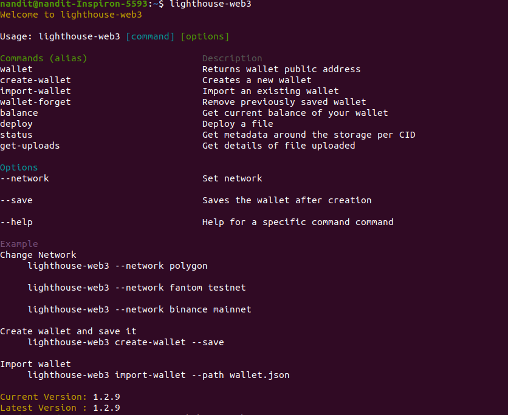

# Overview

****:tools:**Installation**

Install the package globally on your system using our npm package

```
npm install -g @lighthouse-web3/sdk
```


in case you had our old package installed, you will need to uninstall that before installing the above package.&#x20;


**To uninstall old package, run the following command:**

```
npm uninstall -g lighthouse-web3
```

****:page\_facing\_up:**Commands**

The following commands are available with the lighthouse cli tool

1. wallet - Returns public key and connected network
2. create-wallet - Creates a new wallet
3. import-wallet - Imports an existing wallet
4. wallet-forget - Remove previously saved wallet
5. balance - Get the current balance of your wallet
6. deploy - Deploy a directory or file
7. status - Get metadata of a file CID
8. get-uploads - Get details of files uploaded



### ****:globe\_with\_meridians:**Change Network**

The following networks are supported currently -&#x20;

1. Polygon mainnet (polygon)
2. Mumbai testnet (polygon-testnet)
3. Fantom (fantom)
4. Fantom Testnet (fantom-testnet)
5. Binance (binance)
6. Binance Testnet (binance-testnet)

To switch to a mainnet network, use the following command as example -&#x20;

```
lighthouse-web3 --network polygon
```

To switch to a testnet network, use the following command as example -&#x20;

```
lighthouse-web3 --network fantom-testnet
```
