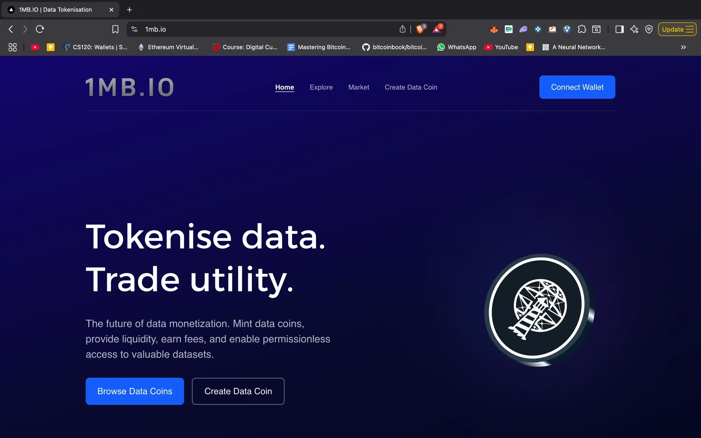
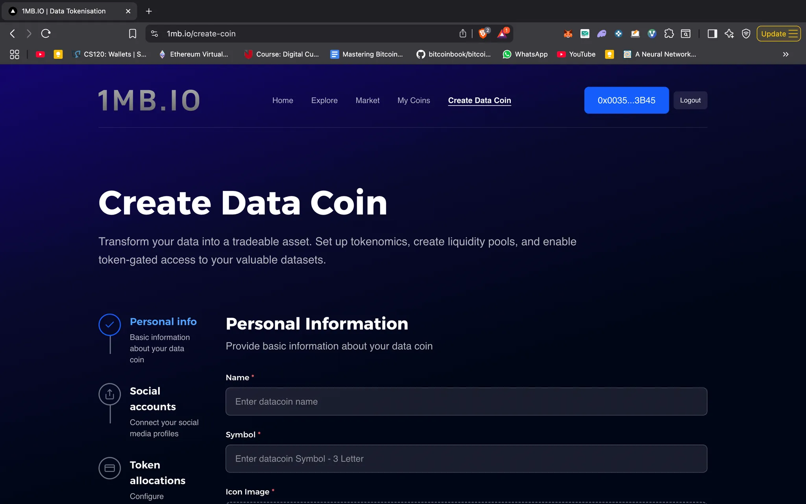
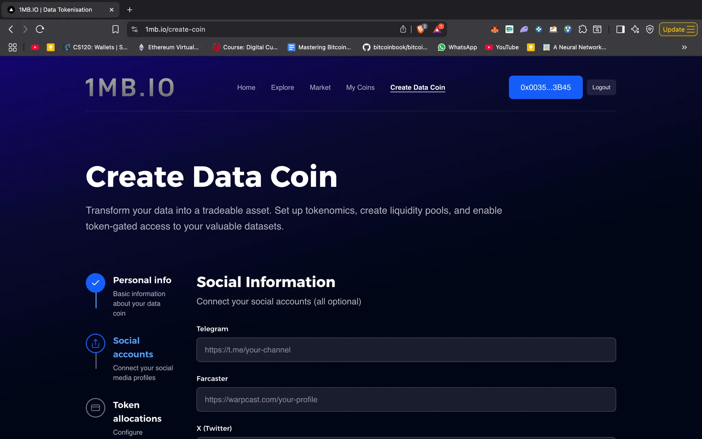
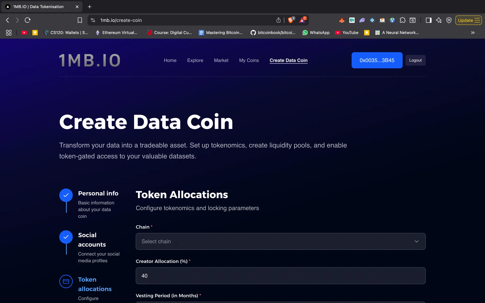
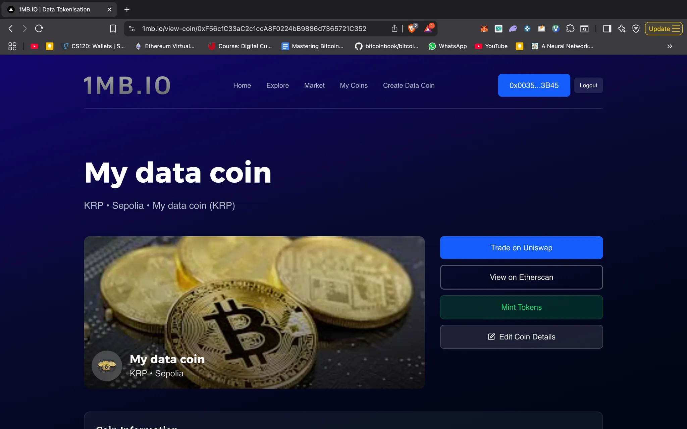

# 🪙 Create a Datacoin

## **🌐 What are DataCoins?**

DataCoins are **crypto-tokens backed by data**. They represent ownership, contribution, and access rights within a **DataDAO** — a decentralised organisation that collects, curates, and monetises data.

* Imagine a community pooling medical research, climate data, or AI training datasets.
* Every contributor is rewarded with DataCoins.
* Consumers (researchers, AI companies, etc.) pay to access the data, fueling the ecosystem.


In short: **DataCoins turn raw data into a tradable, liquid asset.**


## Creating Data coin from [1MB.io](http://1mb.io)

### **Step 1: Connect Wallet**

<figure><figcaption></figcaption></figure>

Connect wallet and click on create data coin.

***

### **Step 2: Enter Personal Information**

<figure><figcaption></figcaption></figure>

Fill out the form with the following details:

* **Name**
* **Symbol**
* **Icon image**
* **Banner image**
* **Website link**

The website link should point to your **DataDAO app**, which defines the logic for collecting data, processing it, issuing the data coin, and tying it to data consumption.

***

### **Step 3: Add Social Information**

<figure><figcaption></figcaption></figure>

Provide your social links such as **Telegram, Farcaster, X, GitHub, and LinkedIn**.

All fields are optional—you can fill in whichever ones you prefer.

***

### **Step 4: Configure Tokenomics** of your choice.

<figure><figcaption></figcaption></figure>

Set up the economics of your data coin:

* **Select a chain:** Sepolia, Base, Polygon, or Worldchain
* **Allocate tokens:**
  * **Creator allocation i.e Yourself** (with optional vesting period)
  * **Liquidity allocation** (used to seed a Uniswap pool with initial liquidity)
  * **Contributor allocation** (for rewarding contributors of your DataDAO)
* **Choose a locking token:** USDC, WETH, or Lighthouse Mock USDC (LSDC).
  * [LSDC faucet link](https://github.com/lighthouse-web3/data-dao-deployment).
  * Each token has a minimum lock amount. You must lock at least that much (or more).

The lock amount and token will be paired with your newly created data coin. Based on your liquidity allocation and lock amount, the system will also display the **initial market price** of your coin.


Once configured, click **Submit Data Coin**. Two transactions will follow:

1. Approval of the lock token
2. Creation of the data coin


***

### **Step 5: View and Manage Your Coin**

<figure><figcaption></figcaption></figure>

After successful creation, you’ll be able to view your coin’s details.

Next, you must grant the **Minter Role** to the address responsible for issuing data coins to contributors.

* This address can be an **EOA** or a **smart contract** with minting logic.
* Go to **Edit Coin Details**, paste the address, and click **Grant Minter Role**.

***

### **Step 6: Programmatic Integration**

If you want to integrate minting into your application or create a data coin programmatically, follow the instructions in this [GitHub repo](https://github.com/lighthouse-web3/data-dao-deployment).
