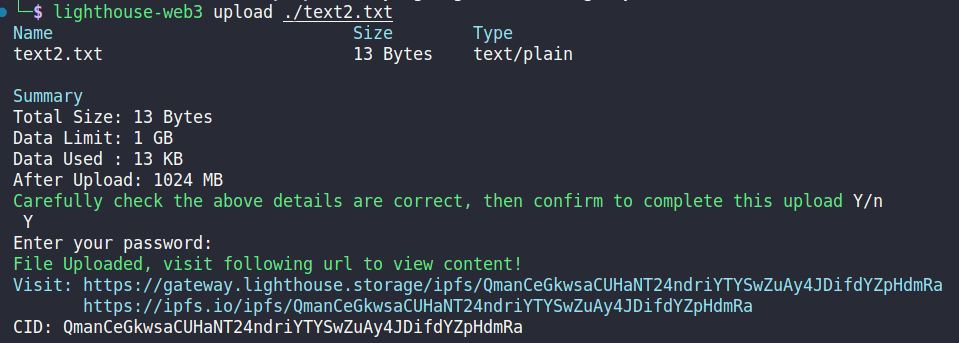
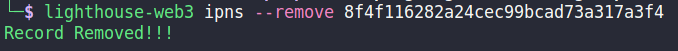

# 📝 Update Content with Lighthouse IPNS

## **Introduction:**

Lighthouse IPNS (InterPlanetary Naming System) is a valuable tool that enables the creation of mutable pointers to content-addressed data in the IPFS (InterPlanetary File System) network. While IPFS ensures content immutability by generating unique CIDs for each piece of data, IPNS allows for regular updates to the content while retaining a consistent address. In this tutorial, we will explore three methods to publish and update content with Lighthouse IPNS: using the CLI (Command Line Interface), Node.js, and Go SDK. By the end of this guide, you will be able to effectively publish and manage IPNS records, making your content easily accessible and updatable.

## **Prerequisites:**

**Before we get started, ensure you have the following:**

1. Basic understanding of [IPFS](https://docs.ipfs.tech/) and [IPNS](https://docs.ipfs.tech/concepts/ipns/) concepts.
2. [Node.js](https://nodejs.org/en/download) installed on your system (for Node.js method).
3. [Lighthouse CLI](https://docs.lighthouse.storage/lighthouse-1/cli-tool/overview) installed (for CLI method).
4. [Go](https://go.dev/doc/install) installed on your system (for Go method).

## **Understanding Mutability in IPFS:**

In IPFS, content is typically addressed using CIDs, making it immutable. However, there are scenarios where content needs to be regularly updated, such as publishing a frequently changing website. IPNS addresses this challenge by creating mutable pointers to CIDs, known as IPNS names. These names act as links that can be updated over time while maintaining the verifiability of content addressing. Essentially, IPNS enables the sharing of a single address that can be updated to point to the new CID whenever content changes.

**How IPNS Works:**

1. **Anatomy of an IPNS Name:** An IPNS name is essentially the hash of a public key. It is associated with an IPNS record that contains various information, including the content path (/ipfs/CID) it links to, expiration details, version number, and a cryptographic signature signed by the corresponding private key. The owner of the private key can sign and publish new records at any time.
2. **IPNS Names and Content Paths:** IPNS records can point to either immutable or mutable paths. When using IPNS, the CID's meaning in the path depends on the namespace used:
   * **`/ipfs/<cid>`**: Refers to immutable content on IPFS, with the CID containing a multihash.
   * **`/ipns/<cid-of-libp2p-key>`**: Represents a mutable, cryptographic IPNS name that corresponds to a libp2p public key.

_**Note: Skip to**_ [#store-and-update-content-on-ipns-using-lighthouse](./#store-and-update-content-on-ipns-using-lighthouse "mention")_**if you already have a Lighthouse API Key**_

#### Step 0: Getting your lighthouse API key [Files-Lighthouse-storage](https://files.lighthouse.storage/):

1. Go on [https://files.lighthouse.storage/](https://files.lighthouse.storage/) and Click on Login

<figure><figcaption></figcaption></figure>

2. Select any of the login method and perform verification steps

<figure><figcaption></figcaption></figure>

3. Click on API Key on the left side panel on the dashboard.

<figure><figcaption></figcaption></figure>

4. Insert name for your API

<figure><figcaption></figcaption></figure>

5. Copy the API Key

<figure><figcaption></figcaption></figure>

## Store and Update content on IPNS using Lighthouse

### **Method 1: Using Lighthouse CLI**

*   **Step 1:** Generate an IPNS key using the Lighthouse CLI:

    ```bash
    lighthouse-web3 ipns --generate-key
    ```

    This command will return an IPNS name and ID, which we will use later to publish the content.

<figure><figcaption></figcaption></figure>


*   **Step 2:** Make a test file, text.txt:

    ```bash
    echo "Hello World" >> text.txt
    ```


*   **Step 3:** Publish this file to the IPFS using [lighthouse upload](https://docs.lighthouse.storage/lighthouse-1/cli-tool/cli-commands/upload):

    ```bash
    lighthouse-web3 upload ./text.txt
    ```

<figure><figcaption></figcaption></figure>


*   **Step 4:** Publish the content using the generated IPNS key and the CID of the data you want to publish:

    ```bash
    lighthouse-web3 ipns --publish --key=8f4f116282a24cec99bcad73a317a3f4 --cid=QmWATWQ7fVPP2EFGu71UkfnqhYXDYH566qy47CnJDgvs8u
    ```

    You will receive a link that can be used to access the published content. This link will remain valid even if the content's IPFS hash changes.

<figure><figcaption></figcaption></figure>

#### **Updating CID:**

*   Upload another file text2.txt:

    ```bash
    echo "Hello World2" >> text2.txt
    ```


*   Publish this file to the IPFS using [lighthouse upload](https://docs.lighthouse.storage/lighthouse-1/cli-tool/cli-commands/upload):

    ```bash
    lighthouse-web3 upload ./text2.txt
    ```

<figure><figcaption></figcaption></figure>


*   Update the content using the generated IPNS key and the CID of the data you want to publish:

    ```bash
    lighthouse-web3 ipns --publish --key=8f4f116282a24cec99bcad73a317a3f4 --cid=QmanCeGkwsaCUHaNT24ndriYTYSwZuAy4JDifdYZpHdmRa
    ```

    You will receive a link that can be used to access the published content. This link will remain valid even if the content's IPFS hash changes.

**List all IPNS** records associated with your Lighthouse account:

```bash
lighthouse-web3 ipns --list
```

This will display a list of IPNS records with their corresponding keys and CIDs.

<figure><figcaption></figcaption></figure>

**Remove** an IPNS record:

```bash
lighthouse-web3 ipns --remove 8f4f116282a24cec99bcad73a317a3f4
```

This step allows you to remove an IPNS record if needed.

<figure><figcaption></figcaption></figure>

### **Method 2: Using Node.js**

For detailed instructions on using Node.js SDK, see the [Node.js subpage](using-node.js-sdk.md).

### **Method 3:** Using Go SDK

For detailed instructions on using Go SDK, see the [Go SDK subpage](using-go-sdk.md).

## **Conclusion**

Lighthouse IPNS is a powerful mechanism for publishing and updating content on the IPFS network. By combining the benefits of content-addressing with the flexibility of mutable pointers, IPNS ensures your content remains accessible and updatable. In this guide, we covered three methods to utilize Lighthouse IPNS: the CLI (JavaScript/TypeScript), Node.js (JavaScript/TypeScript), and Go SDK. Armed with this knowledge, you can confidently publish and manage IPNS records, creating a more dynamic and user-friendly experience on the decentralized web.

Remember to keep your API key secure and use it responsibly. Happy publishing!
