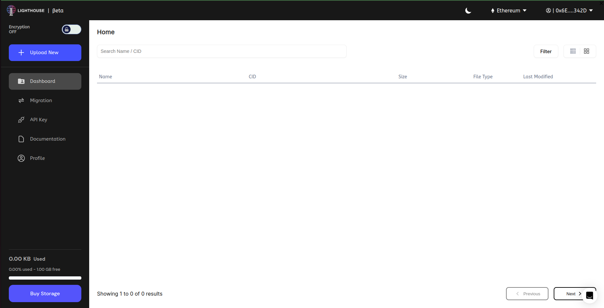

# Use Python SDK

## Introduction

Welcome to the beginner's tutorial on using the Lighthouse Python SDK for perpetual and decentralized file storage. With the integration of IPFS, Filecoin, and smart contracts on various blockchain networks, Lighthouse ensures data permanence, enhanced security, and cost-efficiency. This tutorial will guide you through the essential steps of leveraging the Lighthouse Python SDK to manage files perpetually on the decentralized network.

## Why Lighthouse Python SDK?

This innovative approach utilizes the robustness of IPFS and the storage capacity of Filecoin's miner network, file permanence and redundancy. Let's dive into the Lighthouse Python SDK to harness the power of perpetual decentralized file storage.

## Prerequisites

Before starting with the Lighthouse Python SDK, ensure you have the following:

1. Basic knowledge of Python programming.
2. Python installed on your computer.
3. A Lighthouse API token. If you haven't obtained one yet, sign up on the Lighthouse website to get your API token.

_**Note: If you already have Lighthouse API key, skip Step 0 and go to**_ [#step-1-install-the-lighthouse-python-sdk](use-python-sdk.md#step-1-install-the-lighthouse-python-sdk "mention")

#### **Step 0:** Getting your lighthouse API key [Files-Lighthouse-storage](https://files.lighthouse.storage/):

1. Go on [https://files.lighthouse.storage/](https://files.lighthouse.storage/) and Click on Login

<figure><figcaption></figcaption></figure>

2. Select any of the login method and perform verification steps

<figure><figcaption></figcaption></figure>

3. Click on API Key on the left side panel on the dashboard.

<figure><figcaption></figcaption></figure>

4. Insert name for your API

<figure><figcaption></figcaption></figure>

5. Copy the API Key

<figure><figcaption></figcaption></figure>

***

### **Step 1:** Install the Lighthouse Python SDK

Begin by installing the Lighthouse Python SDK via pip, allowing you to interact with the Lighthouse protocol seamlessly:

```bash
pip install lighthouseweb3
```

### **Step 2:** Import the Lighthouse Python SDK and Initialize

After installing the SDK, import the required libraries and initialize the Lighthouse client with your API token:

```python
import io
from lighthouseweb3 import Lighthouse

# Replace "YOUR_API_TOKEN" with your actual Lighthouse API token
lh = Lighthouse(token="YOUR_API_TOKEN")
```

### **Step 3:** Upload a File

Next, let's upload a file to Lighthouse. We can use the **`upload`** function for this purpose. We'll demonstrate both regular file upload and file upload with tags:

```python
# Regular file upload
source_file_path = "./path/to/your/file/or/directory"
upload = lh.upload(source=source_file_path)
print("Regular File Upload Successful!")

# File upload with tags
tagged_source_file_path = "./path/to/your/file/or/directory"
tag = "your_tag_name"
upload_with_tag = lh.upload(source=tagged_source_file_path, tag=tag)
print("File Upload with Tag Successful!")
```

### **Step 4:** Get Upload Information

After uploading a file, you might want to retrieve its information, such as the Content Identifier (CID). We can use the **`getUploads`** function for this purpose:

```python
# Replace "YOUR_CID_TO_CHECK" with the actual CID you want to check
file_cid_to_check = "YOUR_CID_TO_CHECK"
list_uploads = lh.getUploads(file_cid_to_check)
print("Upload Information:")
print(list_uploads)
```

### **Step 5:** Download a File

Now, let's download a file from Lighthouse using its CID. We'll use the **`download`** function to achieve this:

```python
# Replace "YOUR_CID_TO_DOWNLOAD" with the actual CID of the file you want to download
file_cid = "YOUR_CID_TO_DOWNLOAD"
destination_path = "./downloaded_file.txt"

file_info = lh.download(file_cid) # The file_info is a tuple containing the file content and its metadata

file_content = file_info[0] # Save the downloaded file to the destination path

with open(destination_path, 'wb') as destination_file:
	destination_file.write(file_content)

# The file has been successfully downloaded and saved to the destination_path
print("Download successful!")
```

### **Step 6:** Check Deal Status

Lighthouse allows you to check the status of a file's deal on the network. This can be useful to ensure that the file is accessible and replicated. Use the **`getDealStatus`** function to check the deal status:

```python

# Replace "YOUR_CID_TO_CHECK_STATUS" with the actual CID whose deal status you want to check
file_cid_to_check_status = "YOUR_CID_TO_CHECK_STATUS"
deal_status = lh.getDealStatus(file_cid_to_check_status)
print("Deal Status:")
print(deal_status)
```

### **Step 7:** Download Files by Tag

If you've tagged your files during the upload, you can easily retrieve them by tag using the **`getTagged`** function:

```python
# Replace "YOUR_TAG_TO_DOWNLOAD" with the actual tag name you want to download files for
tag_to_download = "YOUR_TAG_TO_DOWNLOAD"
downloaded_files_with_tag = lh.getTagged(tag_to_download)
print("Files Downloaded with Tag:")
print(downloaded_files_with_tag)
```

## Conclusion

Congratulations! You have successfully learned how to interact with the Lighthouse API for file upload, download, tagging, and checking deal status. You can now integrate Lighthouse into your own applications to manage files securely and efficiently. Keep exploring the Lighthouse documentation to discover more features and functionalities offered by the platform.

Remember to handle exceptions appropriately in your applications, and make sure to secure your API token to protect your data on the Lighthouse platform. Happy coding!
